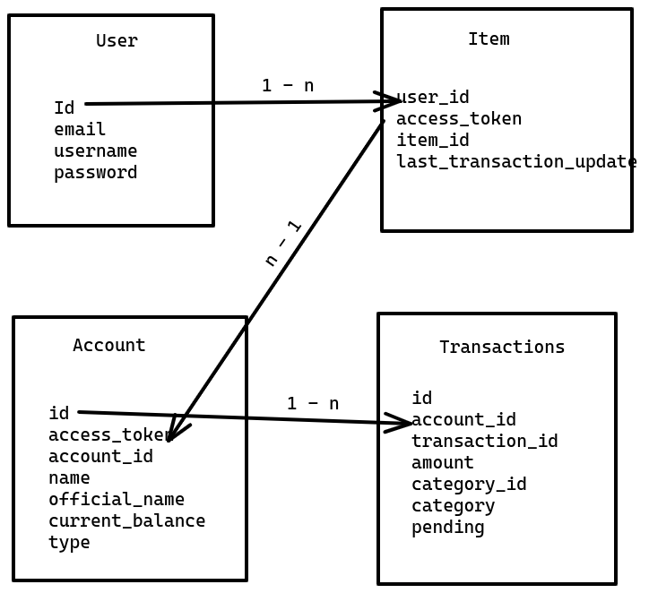

## Django Celery Plaid Api Integration

## Prerequisites
 - Python >=3.8
 - pip3
 - MySQL v8.0.30
 - Redis >=v=5.0.7

## Setup

- clone the repo
  ```
  git clone https://github.com/siva2204/plaid-api-django.git
  ```

- initialize virtual env
  ```
  pip3 install virtualenv

  cd plaid-api-django && virtualenv env

  source source env/bin/activate
  ``` 
- install dependencies
  ```
  pip3 install -r requirement.txt
  ``` 
- Update Database credentials and CELERY_BROKER credentials in `core/settings.py`

- Run server
  - Start Celery
    ```
    celery -A core.celery worker --loglevel=info
    ```
  - Migrations
    ```
    python manage.py makemigrations

    python manage.py migrate
    ```
  - Start sever
    ```
    python manage.py runserver
    ```

- Ngrok setup for webhooks testing
    - Install Ngrok [link](https://ngrok.com/download)

    - run `ngrok http 8000`
    

## Models



- User - Item -> 1 - many relations
- Item - Account -> 1 - many relations
- Account - Transactions  -> 1 - many relations

## Celery tasks
 - get_accounts: fetches accounts associated with Item and adds it to the database
  
 - sync_transactions: fetches transactions related to Item from `transactions/sync` route and updates the data in database(started on webhooks fire)


## Potential Issues
- Inconsistent Celery database updation
  This issue happens when two task are started after one another, where task1 creates a row in a table and task2 updates the row (which is gonna created by task1.
  in some cases task1 might take longer to run and excuting task2 before task1 arises inconsistency in this application

  Solutions:
  - Locking the table (This has its own drawbacks too)
  
- Non Atomic db updates in celery tasks
  For now `sync_transactions` gets all the data to add, update and delete and do this in synchronous way. There might be some inconsistency if there db connections drops or exceptions arises.

  Solutions:
  - can do all this operations Atomically, can use MySQl Transactions
  